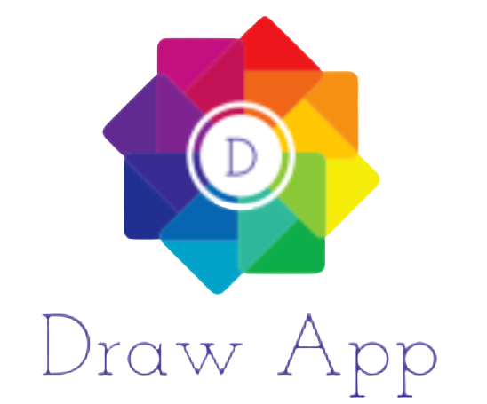

# Draw App: Online Drawing App


<p align="center">
  </p>

Welcome to Draw App, an interactive online drawing application that allows you to unleash your creativity and showcase your art skills! With this app, you can create beautiful drawings using the HTML5 canvas and JavaScript, and instantly upload your masterpieces to a MongoDB database to share them with the world.

Hosted here: https://drawapp-h37j.onrender.com/

## Features

- **User-Friendly Interface**: The app features an intuitive and easy-to-use interface, making it accessible to both beginners and experienced artists.

- **Interactive Drawing**: Utilize the HTML5 canvas element to draw and paint using a variety of brush sizes and colors.

- **Real-time Preview**: See your masterpiece come to life as you draw, thanks to the real-time rendering on the canvas.

- **Save and Share**: Once you've completed your artwork, you can save and upload it to our MongoDB database with a single click.

- **Gallery Display**: Explore a gallery of all the uploaded drawings, admire the creativity of other users, and get inspired by their artistry.

- **Responsive Design**: The app is designed to work seamlessly on both desktop and mobile devices, ensuring you can draw and view drawings on the go.

## How to Use

1. **Drawing**: Select the brush size and color of your choice. Click and drag on the canvas to start drawing.

2. **Reset**: If you make a mistake, don't worry! Switch to the reset tool and correct your drawing.

3. **Saving Your Drawing**: Once you're satisfied with your creation, click the "Submit" button to upload your drawing to the MongoDB database.

4. **Viewing Drawings**: Head over to the drawings section to see all the uploaded drawings. Click on a drawing to view it in full detail.

## Installation

1. Clone this repository to your local machine using:

   ```
   git clone https://github.com/dheeraj70/drawapp.git
   ```

2. Navigate to the project directory:

   ```
   cd drawapp
   ```

3. Type "node app.js" to host app in local machine.

## Technologies Used
- Node Js: For backend.
- HTML5 Canvas: For the drawing interface.
- JavaScript: For handling the drawing functionality and interacting with the MongoDB database.
- MongoDB: To store and retrieve drawings uploaded by users.

## Contributing

We welcome contributions from the community! If you have any suggestions, bug reports, or improvements, please feel free to open an issue or submit a pull request.


---

Ready to unleash your inner artist? Start drawing and sharing your creations with Draw App! Have fun and let your imagination run wild. If you have any questions or need assistance, don't hesitate to reach out.

Hosted here: https://tan-jittery-rhinoceros.cyclic.cloud

*Note: The images and features described in this README are conceptual and may not accurately represent the actual appearance or functionality of the app.*
